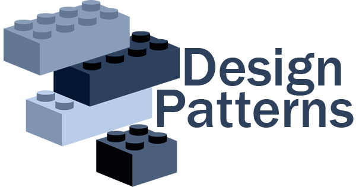

 
 

# Design patterns in golang
>A beginner guide... happy coding!

## Table of Contents

- [Creational patterns](#creational-patterns)
    - [Singleton](#singleton)
    - [Builder](#builder)
    - [Factory](#factory)
    - [Abstract Factory](#abstract-factory)
    - [Prototype](#prototype)
- [Structural patterns](#structural-patterns)
    - [Composition](#composition)
    - [Adapter](#adapter)
    - [Bridge](#bridge)
    - [Decorator](#decorator)
- [Behavioral patterns](#behavioral-patterns)
    - [Chain of responsibility](#chain-of-responsibility)
    - [Strategy](#strategy)
    - [Observer](#observer)
    - [State](#state)
    - [Visitor](#visitor)
    - [Mediator](#mediator)
    - [Template](#template)
    - [Memento](#memento)
    - [Interpretor](#interpretor)
    - [Command](#command)
- [Concurrency patterns](#concurrency-patterns)

---

## Creational patterns
Creational design patterns abstract the instantiation process. They help make a system independent of how its objects are created, composed, and represented.

### Singleton
Ensure a class only has one instance, and provide a global point of access to it.

### Builder
Separate the construction of a complex object from its representation so that the
same construction process can create different representations.

### Factory
Define an interface for creating an object, but let subclasses decide which class to
instantiate. Factory Method lets a class defer instantiation to subclasses.

### Abstract Factory
Provide an interface for creating families of related or dependent objects without
specifying their concrete classes.

### Prototype
Specify the kinds of objects to create using a prototypical instance, and create new objects by copying this prototype.

## Structural patterns
Structural patterns are concerned with how classes and objects are composed to form
larger structures. Structural class patterns use inheritance to compose interfaces or implementations.
As a simple example, consider how multiple inheritance mixes two or
more classes into one.

### Composition
Compose objects into tree structures to represent part-whole hierarchies. Composite
lets clients treat individual objects and compositions of objects uniformly.

### Adapter
Convert the interface of a class into another interface clients expect. Adapter lets
classes work together that couldn' t otherwise because of incompatible interfaces.

### Bridge
Decouple an abstraction from its implementation so that the two can vary independently.

### Decorator
Attach additional responsibilities to an object dynamically. Decorators provide a flexible alternative to subclassing for extending functionality.

## Behavioral patterns
Behavioral patterns are concerned with algorithms and the assignment of responsibilities
between objects. Behavioral patterns describe not just patterns of objects or classes
but also the patterns of communication between them. These patterns characterize
complex control flow that's difficult to follow at run-time. They shift your focus away
from flow of control to let you concentrate just on the way objects are interconnected.

### Chain of responsibility
Avoid coupling the sender of a request to its receiver by giving more than one
object a chance to handle the request. Chain the receiving objects and pass the
request along the chain until an object handles it.

### Strategy
Define a family of algorithms, encapsulate each one, and make them interchangeable.
Strategy lets the algorithm vary independently from clients that use it.

### Observer
Define a one-to-many dependency between objects so that when one object changes state, all its dependents are notified and updated automatically

### State
Allow an object alter its behavior when its internal state changes. The object will appear on change its class

### Visitor
Represent an operation to be performed on the elements of an object structure.Visitor lets you define new operation without changing the classes of the elements of which operates

### Mediator
Define an object that encapsulates how a set of objects interact.Mediator promotes loose coupling by keeping objects from referring to each other explicitly, and it lets you vary their interaction independently

### Template
Define the skeleton of an algorithm in an operation, deferring some steps to subclasses. Template method lets subclasses redefine certain steps of an algorithm without changing the algorithm structure.

### Memento
Without violating encapsulation, capture and externalize an object's internal state so that the object can be restored to this state later.

### Interpreter
Given a language, define a representation for its grammar along with an interpreter that uses the representation to interpret sentences in the language.

### Iterator (Cursor)
Provide a way to access the elements of an aggregate object sequentially without exposing its underlying representation.

### Command
Encapsulate a request as an object, thereby letting you parametrize clients with different requests, and support undoable operations.

## Concurrency patterns
Patterns for concurrent work and parallel execution in Go.
